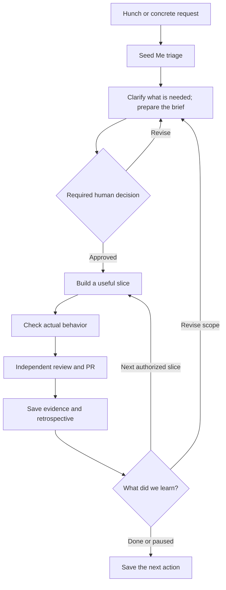

# System design

## Purpose

Help a person and their agents understand one change: its purpose, current state,
evidence and next decision. Build additional capabilities only when use reveals a
concrete need. Features and Futures guides those choices; it adds no approval gate.

## Workflow

An interview is conditional on the request. Required decisions come from the
target repository's installed workflow. Local receipts record decisions; they do
not authenticate release approval. Merge requires its own authority.

## Implemented boundaries

- A Markdown work record holds intent and links. Local configuration selects it
  and a checkout; absolute machine paths stay in that local configuration.
- Git reports checkout and worktree facts. The GitHub CLI reports one linked PR.
- Explicit trust permits running the target's SDLC status command. API 1 identity
  must match the checkout and run. Older text output stays labelled text without
  inferred verification or approval badges.
- The local page and agent CLI share snapshots with timestamps and failures.
  Sources are collected separately; cached state is not proof of current state.
- The archive command preserves committed source and run evidence independently.
  It does not capture all conversations or prove correctness, identity or approval.

The Python package serves static web assets using the standard library. It has no
runtime Python dependencies or frontend build step. The page binds to loopback.
The agent host, workflow tools, GitHub access and project checks remain external.

Automatic dispatch, multiple-project control, active-agent ownership and background
monitoring are not implemented. The dashboard does not change Git or approvals.
